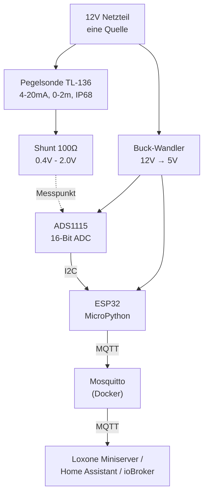
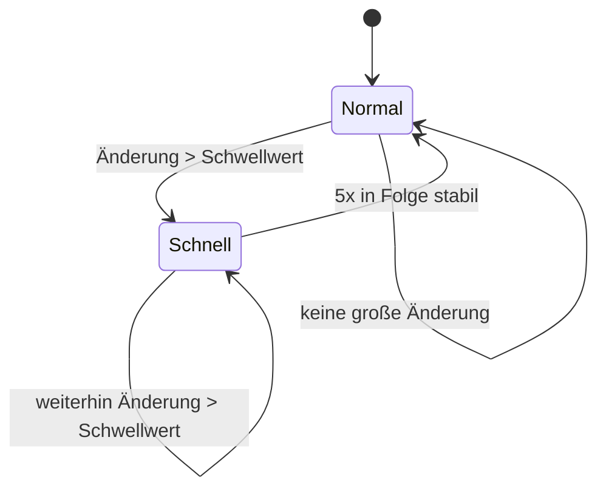

# water-level-sensor

Zisternen-Füllstand messen mit einem ESP32, MicroPython und MQTT — angebunden an Loxone, aber genauso mit Home Assistant, ioBroker oder jedem anderen MQTT-fähigen System nutzbar.

   

Kein Cloud-Dienst, keine App, kein Abo. Ein Sensor im Wasser, ein Mikrocontroller, ein MQTT-Topic. Fertig.

## Was das hier macht

Eine vergrabene Regenwasser-Zisterne (hier: 5300l) bekommt einen Drucksensor, der ihren Füllstand kontinuierlich misst. Ein ESP32 liest den Sensor aus, rechnet ihn in Liter um und schickt das Ergebnis per MQTT ins Heimnetz. Standardmäßig alle 5 Minuten — ändert sich der Füllstand aber gerade stark (z.B. während es regnet oder die Gartenpumpe läuft), schaltet die Firmware automatisch auf alle 20 Sekunden hoch, bis sich der Wert wieder beruhigt hat.





## Warum diese Bauteile (und nicht andere)?

Ich habe bewusst gegen ein paar naheliegende Alternativen entschieden — hier die Begründung, damit du selbst abwägen kannst:

| Entscheidung | Dagegen abgewogen | Warum |
|---|---|---|
| **Hydrostatischer Drucksensor** (4-20mA, im Wasser) | Ultraschallsensor über dem Wasserspiegel | In einem geschlossenen Zisternenschacht sammelt sich Kondenswasser auf der Ultraschallmembran, und ein unruhiger Wasserspiegel (Regen, Pumpe) erzeugt Fehlechos. Im [Loxone-Forum](https://www.loxforum.com/forum/hardware-zubeh%C3%B6r-sensorik/298863-wasserstandsmessung-zisterne) berichten Nutzer von genau diesem Problem bei Ultraschall, während Drucksensoren dort als "wartungsfrei über Jahre" beschrieben werden. |
| **ESP32** | ESP8266 (günstiger) | Mehr RAM/Header für WLAN+MQTT gleichzeitig stabil, Reserve für spätere Erweiterungen (Deep Sleep, BLE). ESP8266 würde technisch auch reichen, mit etwas knapperem Speicher. |
| **MicroPython** | Arduino/C++ | Auf ausdrücklichen Wunsch: interaktive REPL zum Live-Testen ohne Kompilieren. Für einen 5-Minuten-Takt spielt der Geschwindigkeitsnachteil ggü. C++ keine Rolle. |
| **ADS1115 (externer ADC)** | ESP32-eigener ADC | Der interne ADC des ESP32 ist bekanntermaßen nicht besonders linear und rauscht. Für ~4€ mehr bekommt man einen sauberen 16-Bit-Wert. In der Praxis diskutiert, z.B. [hier](https://www.mikrocontroller.net/topic/547528) — für dieses Projekt lohnt sich der externe ADC, ist aber kein Dogma. |
| **100Ω Shunt-Widerstand** | 250Ω (Industriestandard für 4-20mA→1-5V) | Bei nur 12V Versorgung lässt ein kleinerer Shunt mehr Spannung für die Sonde selbst übrig. 100Ω wird auch von Nutzern desselben TL-136-Sensors [empfohlen](https://www.mikrocontroller.net/topic/547528). Die genaue Toleranz des Widerstands ist irrelevant, weil wir empirisch kalibrieren (Schritt 4). |
| **Eine 12V-Quelle für alles** | Getrennte 12V (Sensor) + 5V (ESP32) Netzteile | Community-Berichte bestätigen, dass der TL-136 im Bereich 12-36V zuverlässig läuft — 24V wäre unnötig und ineffizienter. Ein Buck-Wandler 12V→5V spart ein Netzteil und sorgt nebenbei für eine einzige gemeinsame Masse. |

**Ehrliche Grenzen dieses Ansatzes:**
- Die Umrechnung mm→Liter ist eine lineare Näherung (Gesamtvolumen ÷ Gesamthöhe). Bei einer Zisterne mit gewölbtem Boden/Deckel ist das nicht exakt — für "wie voll ist ungefähr meine Zisterne" reicht es, für Abrechnungszwecke nicht.
- Drucksensoren dieser Preisklasse referenzieren über ein feines Belüftungsröhrchen im Kabel gegen den Luftdruck. Wird dieses Röhrchen versehentlich abgedichtet (z.B. beim Verpressen der Kabeldurchführung), driftet die Messung mit dem Wetter statt nur mit dem Wasserstand. Im Betrieb selten dominant, aber gelegentlich mit dem Zollstock gegenprüfen schadet nicht.
- Elektronik in/an der Zisterne altert durch Feuchtigkeit und Frost-Tau-Wechsel schneller als im Haus — die Sonde ist dafür ausgelegt (IP68), die ESP32-Box nicht (deshalb oberirdisch, trocken, siehe Schritt 6).

## Stückliste

| Teil | Menge | Zweck |
|---|---|---|
| ESP32 DevKit (z.B. AZDelivery, CP2102) | 1 | Mikrocontroller |
| ADS1115 16-Bit ADC-Modul | 1 | Liest den Sensor präzise aus |
| 4-20mA Pegelsonde, 0-2m, IP68 (z.B. TL-136) | 1 | Misst den Wasserdruck |
| Widerstand ~100Ω, 1/4W | 1 | Shunt (Strom→Spannung). Toleranz egal |
| Buck-Wandler 12V/24V → 5V | 1 | Versorgt ESP32 + ADS1115 aus derselben Quelle |
| 12V DC Netzteil, mind. 1,5-2A | 1 | Einzige Stromquelle für alles |
| Elko 470µF 35V | 1 | Puffert WLAN-Stromspitzen am 5V-Eingang |
| Wetterfestes Gehäuse IP65+ | 1 | Für ESP32 + ADS1115 + Buck-Wandler |
| Multimeter | - | Für Kalibrierung unverzichtbar |

## ⚠️ Bevor du irgendetwas verkabelst

**Prüfe die Betriebsspannung deiner konkreten Sonde** auf der Produktseite/dem Aufdruck. TL-136-Varianten kursieren mit "24VDC" und mit "12-32VDC" als Angabe — beides existiert unter demselben Namen bei verschiedenen Verkäufern. Diese Anleitung geht von einer Sonde aus, die 12V verträgt. Steht auf deiner ausdrücklich nur "24V" ohne Bereichsangabe, nimm ein 24V-Netzteil (der Buck-Wandler oben verträgt beides).

## Schritt 1: Verkabelung

1. **Sensor-Loop:** 12V(+) → Sonde(+) → Sonde(–) → Knotenpunkt A → 100Ω-Widerstand → 12V(–)/GND.
2. **Logik-Versorgung:** 12V(+) → Buck-Wandler IN(+); Buck-Wandler GND an 12V(–). Buck-Ausgang (5V) → ESP32 5V/VIN-Pin und ADS1115 VDD.
3. **Messung:** ADS1115 AIN0 → Knotenpunkt A. ADS1115 SDA → ESP32 GPIO21, SCL → GPIO22.
4. **Masse:** Ein nicht-isolierter Buck-Wandler verbindet Eingangs- und Ausgangsmasse intern automatisch — du musst nichts manuell verschienen, es gibt nur eine gemeinsame Masse im ganzen System.
5. **Niemals 12V direkt in den VIN/5V-Pin des ESP32 stecken** — der onboard-Linearregler würde die Differenz verheizen (mehrere Watt auf einem Bauteil ohne Kühlkörper) und thermisch abschalten. Deshalb der Buck-Wandler.

## Schritt 2: Trockentest

1. Alles auf dem Tisch aufbauen, Sonde noch **an der Luft** (nicht im Wasser).
2. 12V einschalten, Multimeter zwischen Knotenpunkt A und GND messen.
3. Erwartung bei 100Ω: ca. **0,40V** (4mA × 100Ω = 0% Füllstand). Kleine Abweichung ist normal.
4. Notiere den Wert als **U₀**.

## Schritt 3: Nasskalibrierung

1. Rohr/Eimer mit Wasser füllen, exakt **1000mm Tiefe** messen (Referenzpunkt: die Druckmembran der Sonde, siehe Sondenspitze).
2. Sonde bis zu dieser Tiefe eintauchen, 30s warten, Spannung ablesen → **U₁** bei **H1_MM = 1000**.
3. In `esp32/config.py` eintragen: `U0`, `U1`, `H1_MM`. Der Rest (`K`) wird in `main.py` automatisch berechnet.
4. **Warum das funktioniert, egal wie ungenau der Widerstand ist:** Die Formel `K = H1_MM / (U1 - U0)` nutzt deine *gemessenen* Spannungen, nicht den Nennwert des Widerstands oder Herstellerangaben — Fertigungstoleranzen kürzen sich dadurch automatisch raus.

## Schritt 4: Firmware (MicroPython)

**Warum nicht Arduino IDE?** Arduino IDE compiliert C/C++, kein Python. Für echtes Python brauchst du MicroPython-Firmware auf dem ESP32 — das ersetzt die Arduino-Firmware komplett.

1. **Thonny IDE** installieren (thonny.org) — flasht MicroPython und bietet eine REPL zum Live-Testen.
2. Werkzeuge → Optionen → Interpreter → "MicroPython (ESP32)" → Firmware installieren.
3. Bibliotheken auf den ESP32 laden (nicht ins Projektverzeichnis auf dem PC!):
   ```python
   # In der Thonny-REPL, ESP32 muss WLAN-Zugriff haben:
   import mip
   mip.install("umqtt.robust")   # zieht umqtt.simple als Abhängigkeit automatisch mit
   ```
   Danach prüfen, dass beide Dateien wirklich da sind: `import os; os.listdir("/lib/umqtt")` sollte `simple.py` und `robust.py` zeigen. Falls nicht, beide manuell von [micropython-lib](https://github.com/micropython/micropython-lib/tree/master/micropython/umqtt.robust) hochladen.
   Für den ADC-Treiber gibt es kein mip-Paket: [ads1x15.py](https://github.com/robert-hh/ads1x15/blob/master/ads1x15.py) herunterladen und per Thonny-Dateimanager hochladen.
4. [esp32/boot.py](esp32/boot.py) und [esp32/main.py](esp32/main.py) hochladen.
5. [esp32/config.example.py](esp32/config.example.py) lokal zu `esp32/config.py` kopieren, WLAN-Zugangsdaten, MQTT-Zugangsdaten und Kalibrierwerte darin eintragen, dann `config.py` ebenfalls auf den ESP32 hochladen.

   `config.py` steht in `.gitignore` und wird nie committet — nur `config.example.py` (die Vorlage mit Platzhaltern) landet im Repo. So kann niemand aus Versehen sein WLAN-Passwort öffentlich auf GitHub pushen.

### Debug-Workflow

1. **Interaktiv in der REPL testen, bevor irgendwas automatisch läuft:**
   ```python
   i2c.scan()          # sollte [72] zeigen (0x48 als Dezimalwert)
   ads.read()           # Rohwert, mit Multimeter-Spannung vergleichen
   ```
2. Erst wenn WLAN, Sensor und MQTT einzeln funktionieren: ESP32 einmal resetten (Knopf oder Stecker) — ab da läuft `main.py` automatisch beim Einschalten, auch ohne PC. Das ist der Produktivbetrieb.
3. **Debugging nach dem Einbau (kein USB-Zugriff mehr):** Das Topic `zisterne/status` enthält WLAN-Signalstärke, Laufzeit und aktuelles Messintervall als JSON — mit z.B. **MQTT Explorer** von unterwegs prüfbar.
4. Der Watchdog (`machine.WDT`, siehe `boot.py`) setzt den ESP32 automatisch zurück, falls die Schleife hängt. **Wichtig:** Sein Timeout (60s) ist kürzer als das lange Messintervall (300s) — deshalb schläft `main.py` in 5-Sekunden-Häppchen mit `feed()` dazwischen, statt am Stück 300s zu schlafen. Ohne diesen Kniff würde sich der ESP32 alle 5 Minuten selbst neu starten.

### Schwellwert für die adaptive Frequenz ermitteln

`CHANGE_THRESHOLD_MM` in `config.py` ist ein Startwert, kein Naturgesetz — er muss zur tatsächlichen Rauschstreuung deines Aufbaus passen:

1. Nach der Installation, bei ruhigem Wasserstand, 20x hintereinander `level_mm()` in der REPL aufrufen und die Werte notieren.
2. Die Streuung (max − min) ablesen.
3. `CHANGE_THRESHOLD_MM` auf das 3-5-fache dieser Streuung setzen. Zu niedrig → das System schaltet ständig grundlos auf die schnelle Frequenz; zu hoch → echte Änderungen werden erst spät erkannt.

## Schritt 5: MQTT-Broker (Mosquitto per Docker)

```bash
cd mosquitto
docker run --rm -it -v "$(pwd)/config:/mosquitto/config" eclipse-mosquitto:2 \
  mosquitto_passwd -c /mosquitto/config/passwd esp32
docker compose up -d
```

Testen:

```bash
mosquitto_sub -h <IP-deines-Servers> -u esp32 -P <dein-Passwort> -t 'zisterne/#' -v
```

`MQTT_BROKER`, `MQTT_USER`, `MQTT_PASSWORD` in `esp32/config.py` entsprechend eintragen.

## Schritt 6: Einbau in die Zisterne

1. Sonde **nicht auf dem Boden ablegen** (Sediment verfälscht) — 5-10cm darüber aufhängen. Diesen Abstand als `H_OFFSET_MM` eintragen.
2. Zugentlastung über ein Stahlseil/Schnur, **nicht am dünnen Sensorkabel selbst hängen lassen**.
3. Kabeldurchführung am Deckel abdichten, aber das interne Belüftungsröhrchen der Sonde dabei nicht zusammendrücken (siehe "Ehrliche Grenzen" oben).
4. ESP32-Box **oberirdisch und trocken** platzieren — nur die Sonde selbst ist für dauerhaften Wasserkontakt ausgelegt.

## Schritt 7: Endkontrolle

1. Tatsächlichen Wasserstand per Zollstock durch die Inspektionsöffnung messen.
2. Mit dem berechneten Wert vergleichen. Bei Abweichung zuerst `H_OFFSET_MM` korrigieren (Montagehöhe), nicht `U0`/`U1` anfassen.

## Schritt 8: Loxone-Anbindung

Der Loxone Miniserver (Gen 2 bzw. aktuelle Firmware) ist ein **MQTT-Client**, kein Broker — er verbindet sich zum selben Mosquitto wie der ESP32 und abonniert die Topics `zisterne/fuellstand/liter` bzw. `.../prozent` als virtuelle Eingänge. Ältere Miniserver-Generationen ohne natives MQTT brauchen eine Bridge (z.B. Node-RED).

## Troubleshooting

| Symptom | Wahrscheinliche Ursache |
|---|---|
| `i2c.scan()` liefert `[]` | SDA/SCL vertauscht, oder ADS1115 bekommt keine 5V |
| Spannung an Knotenpunkt A bleibt bei 0V | Sensor-Loop unterbrochen, Polarität der Sonde prüfen |
| Wert driftet langsam über Tage, ohne dass sich der Pegel ändert | Belüftungsröhrchen der Sonde blockiert (Luftdruck statt Wasserdruck), oder Kalibrierpunkt neu aufnehmen |
| ESP32 resettet ungefähr alle 5 Minuten | Watchdog-Fix aus Schritt 4 fehlt/wurde entfernt |
| Ständig im "schnellen" Messintervall | `CHANGE_THRESHOLD_MM` zu niedrig für das reale Rauschen, siehe Schritt 4 |
| MQTT verbindet nicht | Broker-IP/Zugangsdaten in `esp32/config.py` prüfen, `mosquitto_sub` vom PC aus testen |
| `ImportError: no module named 'config'` | `config.py` fehlt auf dem ESP32 — `config.example.py` kopieren, ausfüllen, hochladen |

## Lizenz

MIT, siehe [LICENSE](LICENSE).

## Quellen & weiterführend

- [Loxone-Forum: Wasserstandsmessung Zisterne](https://www.loxforum.com/forum/hardware-zubeh%C3%B6r-sensorik/298863-wasserstandsmessung-zisterne)
- [Mikrocontroller.net: TL-136 4-20mA an µController](https://www.mikrocontroller.net/topic/547528)
- [robert-hh/ads1x15 (MicroPython-Treiber)](https://github.com/robert-hh/ads1x15)
- [micropython-lib: umqtt.robust](https://github.com/micropython/micropython-lib/tree/master/micropython/umqtt.robust)
